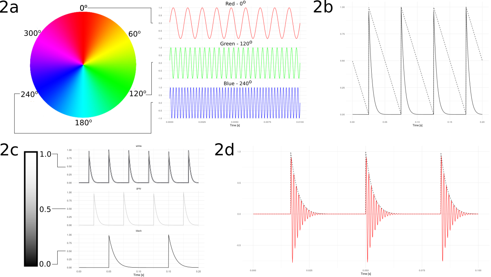

# Psyclops

You can listen to color!

This app is a tool aiming for the development and training of sonochromatic skills. Sonochromatism consists of perceiving distinct colors by converting their information into sounds, allowing for visually impaired people to also discriminate colored objects. It was inspired in the Eyeborg, developed by Adam Montandon and Neil Harbinsson, which evolved to an antenna coupled to an intracranial transplant that execute the same function. Psyclops runs on Android smartphones, widely available devices for people who wish to explore snonchromatism in a non-invasive manner.

This software works by taking the RGB (Red, Green, Blue) values of a pixel at the center of the image captured by the main camera and by generating audio clicks that allow to interpret the pixel's color. Light colors will produce more clicks per second, while darker colors produce clicks with a higher time interval between them. The pitch of the clicks also change based on the detected color, where higher pitches correspond to blue tones and even magenta, and lower pitches are associated to red colors. Technically, the detected pixel color is processed in HSV (Hue, Saturation, Value) coordinates, where the rate of clicks is proportional to the V coordinate (brightness), and their pitch, to the H coordinate.

The app is still being developed, and newer versions with a more user-friendly interface and functionalities will be released in the future. You can download it from the [Play Store](https://play.google.com/store/apps/details?id=com.psyclops). Currently, there is no support for iOS devices.

## Software

The code was written on top of the [CameraX API example [1]](https://codelabs.developers.google.com/codelabs/camerax-getting-started/). Briefly, the app takes the average color of a square in the center of an image acquired by the camera and generates a sound based on the computed color's hue and lightness.

### Execution flow

When the app starts, the camera is initialized to capture images and an object of the *RepeatingThread* class is created to produce the sounds. The *RepeatingThread* instance has an attribute called mBitmap which is updated with the most recent image captured by the camera. 

While the camera acquires images and updates the mBitmap attribute, the *RepeatingThread* object computes the average RGB color in a 30px square at the center of the last picture. This value is converted into HSV coordinates (see scientific explanation) and those values are fed into an object of the *AudioWave* class, which will produce the sound to be played by the device. After calling the *AudioWave* function to play the generated sound, The *RepeatingThread* instance sleeps for 100 milliseconds.

The *AudioWave* object produces the waveform described in the scientific explanation section for a duration of 100 milliseconds and writes it to the sound buffer. When the current audio block is finished playing, another one will be started by another call of the *RepeatingThread* object. This process is repeated during the whole execution.

### User experience

In order to improve usability, two features are currently implemented: a wake lock toggle and the training mode screen.

The wake lock allows you to block your phone from sleeping, given that the camera is only accessible while the app is running on foreground. Since the app uses the camera continuously, it is battery consuming - this will likely be optimized in future versions. Also, the wake lock is not working properly when the app returns from background, I will also address it in future versions.

The training mode is convenient to better visualize the color at the center of the screen and allows you to practice listening to the tunes while training your brain.

In the future, I plan to implement a play/pause button and an internal volume control as well, so you can control the relative volume of the app even when running it along with other applications.

### Some remarks

The *RepeatingThread* logic allows the tool to acquire pictures and compute the central square average while the previous audio block is still playing. This is useful because, when I implemented a loop that would compute the color, generate the waveform and play it, there was a brief interval between each audio block. 

In order to make it easier to use other sonochromatic scales, I also plan to refactor the code in a way that the logic is centered around a class interface that takes the image and generates the sound. This interface can then be inherited by any class with its own internal logic.

## Hardware

This app runs in any smartphone running Android 5 or higher. The device must have a camera and play audio.

## Scientific explanation

This software converts the information contained in a color into a sound wave. In order to fully comprehend how it works, we need to cover some basics on color theory and signal processing.

### What is Color?

In order to understand color, we need to differentiate it from light. Light is an electromagnetic wave [[2](http://www.handprint.com/HP/WCL/color1.html)]. Color is a psychic experience [[2](http://www.handprint.com/HP/WCL/color1.html)]. While the properties of light rays are defined when it is produced by its emitter, the experience of color is intimately associated with the neuron network that sensed those light rays [[2](http://www.handprint.com/HP/WCL/color1.html),[3](https://webvision.med.utah.edu/book/part-vii-color-vision/color-vision/)]. These networks vary  according to each species: dogs have two types of cells that respond to light (called photoreceptors) [[4](https://pubmed.ncbi.nlm.nih.gov/19112529/)], while the mantis shrimp has more than ten photoreceptor types [[5](https://www.nature.com/articles/339137a0)]. Those signals are then processed by the complex network of neurons implicated in visual experience.

Humans have four cell types that respond to light [[2](http://www.handprint.com/HP/WCL/color1.html),[3](https://webvision.med.utah.edu/book/part-vii-color-vision/color-vision/),[6](http://www.cvrl.org/)]. Rods respond mostly to light with length around 505 nm and saturate with low levels, being useful during the night. Cones can produce different types of pigments that will make it respond differently to three regions of the light spectrum. The first one responds to light around 565 nm, which is perceived as a greenish yellow by people - it is the one with the lowest frequency, so it is the best responder to "red", being named as "red" cone. The other two cones respond, respectively, to "green" (at around 540 nm) and "blue" (445 nm).

We can represent a color by determining the level of activation of each type of sensor. The International Commission on Illumination [[7](http://cie.co.at/)] carried out several experiments where volunteers had to match a color by changing the intensities of lamps with distinct colors and conceived the first color system [[2](http://www.handprint.com/HP/WCL/color1.html),[6](http://www.cvrl.org/),[8](https://www.xritephoto.com/documents/literature/en/L11-029_color_guide_EN.pdf)]. As theories of color evolved, we developed several ways of representing colors. RGB is very convenient because it maps directly to our sensors. The system CMYK is good for pigments, which absorb light - this is why we call this the subtractive system. The HSV is defined on characteristics related to our perception of color.

Given its simplicity and the proximity with our perception, this project is based on the HSV system [[8](https://www.xritephoto.com/documents/literature/en/L11-029_color_guide_EN.pdf), [9](https://www.w3schools.com/colors/colors_hsl.asp)]. Hue is related to the color per se, being a number between 0 and 360. Saturation, also known as the "white contamination", corresponds to how saturated the color is, with smaller values corresponding to grayscale values and higher values corresponding to "pure hues". Finally, Value (or Lightness, in the acronym HSL) is its brightness, with low values corresponding to black, and higher values, to white.

If you visualize that each component of the RGB system forms an axis of a graph, we have a 3D graph like the one in Fig 1a. Each point in this 3D space corresponds to a distinct color, described by its coordinates, which represent the relative intensity of each primary channel.  The HSV system is mapped to a cylindrical coordinate system, as shown in Fig 1b. The coordinate associated with Hue corresponds to the angle relative to pure red, increasing as the color tone gets orange, yellow, green, cyan, blue and magenta, until it reaches red again. Saturation represents the distance to the cylinder center, where the central axis is formed by gray colors. Finally, Value is associated with the vertical coordinate.  You can experiment interactively with the RGB-HSV mapping [here \[9\]](https://www.w3schools.com/colors/colors_hsl.asp).

**Fig 1.** (a) The rectangular RGB coordinate system (b) The cylindrical HSV coordinate system. [Image by Michael Horvath CC BY-SA \[10\]](https://commons.wikimedia.org/wiki/User:Datumizer).

At each shot taken from the camera, the color of the central pixel is converted to HSV and those values are used in order to shape the audio waveform.

### Audio Generation

Sound consists of mechanical waves that travel through a medium, such as air. In humans, these waves vibrate our eardrum and get propagated until they reach the hair cells inside the cochlea in our inner ear [[11](https://www.nature.com/articles/ncomms1533)]. The position of a stimulated cell will make it respond to a specific sound frequency, which will cause an auditory experience of a specific pitch.

As the original Eyeborg, developed by Adam Montandon & Neil Harbisson [[12](https://en.wikipedia.org/wiki/Sonochromatism)], Psyclops associates a determined hue to a specific pitch. This technique is called "frequency modulation", where we encode information in the frequency of a wave [[13](https://www.ni.com/fr-fr/innovations/white-papers/06/frequency-modulation--fm-.html)]. The advantage of this technique is that the wave frequency does not decay as the wave travels, in contrast to amplitude modulated waves. In this case, the information is encoded in the wave amplitude - or the volume of the sound in the scope of this project. Here, a *Hue* value of 0 corresponds to 900 Hz, and a *Hue* value of 359, to 6.3k, as illustrated by Fig 2a.

**Fig 2** (a) *Hue* convertion into the frequency of a sinusoidal wave. (b) Sawtooth wave (dashed line) with polynomial decay (solid line). (c) *Brightness* convertion into the frequency of a sawtooth wave with polynomial decay. (d) Psyclops generated sound waveform.

Additionally, this project encodes *Brightness* information in the same wave. This is done by enveloping our sinusoidal wave inside another wave. This one is a sawtooth with a polynomial decay, producing the auditory experience of a "click" (see Fig 2b). A *Brightness* of 0.0 is represented by a wave with 10 clicks per second, while a *Brightness* of 1.0 is converted into a wave with 30 clicks per second (Fig 2c).  When we multiply both waves, we get the result in Figure 2d. Therefore, Psyclops modulates two parameters on the generated sound: the frequency of the sine wave and the frequency of the polynomial sawtooth wave. The first one is perceived as the pitch of the sound in itself, while the polynomial sawtooth is perceived as more or less spaced clicks. The more frequent the clicks, the brighter the color.

### Yet another sonochromatic scale

**Fig 3** xkcd comic [[14](https://xkcd.com/927/)].

So far, two sonochromatic scales have been developed [[12](https://en.wikipedia.org/wiki/Sonochromatism),[15](http://augmentedorganism.com/augmented-organism-sonochromatic-audio-visual-design)]. Here, I propose another one [[14](https://xkcd.com/927/)], which will be updated in future work. Indeed, each sonochromat should keep in mind they are free to experiment and customize their own senses according to their own internal references, and are encouraged to play with distinct waveforms and color encodings. A good place to start exploring how we perceive distinct waveforms is the Chrome Music Lab Oscillators [[16](https://musiclab.chromeexperiments.com/Oscillators/)] to hear how sines, square and sawtooth waves sound different.

In his TED talk presentation given in 2009, Beau Lotto introduces yet another way of translating a grayscale image into sound, integrating the information of several pixels into the generated waveform [[17](https://www.youtube.com/watch?v=mf5otGNbkuc)]. This interesting example shows the potential of integrating information about the context in the image. It's worth noting that vision processing takes a considerable amount of brain energy and that humans are gifted with an amazing neural network that processes and identifies objects in a relatively high resolution at several frames per second [[18](https://www.dovepress.com/energy-metabolism-of-the-visual-system-peer-reviewed-article-EB)]. This suggests that our auditory cortex might not be developed enough in order to use sound as a way to replace vision itself. However, there's plenty of room at the bottom yet to be explored before this limitation becomes significant. 

### Going deeper

If you are interested in learning more about the **Cyborg movement**, I definitely recommend getting to know about the story of Neil Harbisson and Moon Ribas, an artist who has explored a few senses and is now able to feel seismic movements through implants in her feet.

Professor Dr Maria José Santos Pompeu Brasil, from the State University of Campinas, assembled an [interesting list with references \[19\]](https://sites.ifi.unicamp.br/brasil/teach/) to **color theory**. The page is in Potuguese, but you may barely need to translate it in order to find the links - most of them in English.

If you are into the **biology of hearing**, Professor Jonathan Ashmore gives a [great class \[20\]](https://www.youtube.com/watch?v=boiOGH-336Q) on how our ears transduce sound into neurotransmitters.

For those who wish to dive into the possibilities of **developing sonochromatic scales**, I recommend doing some research on signal processing, such as distinct types of modulation and maybe Fourier Transforms. I am sure those concepts will bring even more disruptive innovations to this exciting exploration of expressing our nature in more comprehensive ways.

## Future

This project can evolve in so many directions it is hard to predict how it will grow over time. The next steps I envision are:

In order to ease the implementation of new scales, I will design an **interface that take an image as an input and returns a vector containing the sound to be played** (as mentioned in the software section). This reduces the amount of effort required to expand on the project by establishing a contract that talks directly with the inner working of the software. Therefore, developers can only add one file containing an implementation to the interface and instantiate it in the main function. Dependending on the security constraints, users could even modify the code on the fly and experiment in real time with new sonochromat scales on their device.

I also would like to explore **more complex sonochromat scales**, by integrating several pixels into a waveform and providing more higher level information (as mentioned in the scientific explanation). One can also play with auditory illusions, such as [binaural beats \[21\]](https://en.wikipedia.org/wiki/Beat_(acoustics)#Binaural_beats), to have [more comprehensive experiences \[22\]](http://augmentedorganism.com/augmented-organism-sonochromatic-audio-visual-design).

So far, the **sonochromat scales** are very basic on their mathematical description and **can be greatly expanded**. The world of electronic music has several effects that can be parametrized and convey information to a listener, opening the possibilities for a myriad of ways to represent colors. Another source inspiration is the movement of Oscilloscope Music [[23](https://www.youtube.com/watch?v=4gibcRfp4zA), [24](https://www.youtube.com/watch?v=5WBWIKnr0Os), [25](https://www.youtube.com/watch?v=J2YQD8Go_Hc)], which also provides a bridge between visual and auditory experience under waveforms generated by computers.

An interesting question is about **how the produced sounds can be entertaining**. Art is a product of patterns carefully arranged to make a harmonious piece. Psyclops, however, is designed to be a tool of sensing the world around us. At first, it looks challenging to develop a sonochromat scale that will produce pleasant melodies for an arbitrary set of landscapes. In his song *Final Boss* [[26](https://www.youtube.com/watch?v=VGh5DV0D3wk)], Nitro Fun spells an encoded message in binary using high and low pitch beeps. The insight is genious and the message plays really well in its context, however I believe a song played entirely in binary would need some tweaking in order to sound artistically interesting. After all, a handshake betwen science and art implies a respect that needs to come from both sides [[27](https://www.youtube.com/watch?v=G94yp-a8XG8)]. Therefore, I am eager to receiver suggestions that may improve user experience in an artistic sense as well. As a final note, a connexion between audio and video can be and have been explored by artists, as already performed by Neil Harbinsson himself [[28](https://www.saatchiart.com/neilharbisson),[29](http://www.artwiki.fr/wakka.php?wiki=NeilHarbisson)].

## References

[1] https://codelabs.developers.google.com/codelabs/camerax-getting-started/

[2] http://www.handprint.com/HP/WCL/color1.html

[3] https://webvision.med.utah.edu/book/part-vii-color-vision/color-vision/

[4] https://pubmed.ncbi.nlm.nih.gov/19112529/

[5] https://www.nature.com/articles/339137a0

[6] http://www.cvrl.org/

[7] http://cie.co.at/

[8] https://www.xritephoto.com/documents/literature/en/L11-029_color_guide_EN.pdf

[9] https://www.w3schools.com/colors/colors_hsl.asp

[10] https://commons.wikimedia.org/wiki/User:Datumizer

[11]  https://www.nature.com/articles/ncomms1533

[12] https://en.wikipedia.org/wiki/Sonochromatism

[13] https://www.ni.com/fr-fr/innovations/white-papers/06/frequency-modulation--fm-.html

[14] https://xkcd.com/927/

[15] http://augmentedorganism.com/augmented-organism-sonochromatic-audio-visual-design

[16] https://musiclab.chromeexperiments.com/Oscillators/

[17] https://www.youtube.com/watch?v=mf5otGNbkuc

[18] https://www.dovepress.com/energy-metabolism-of-the-visual-system-peer-reviewed-article-EB

[19] https://sites.ifi.unicamp.br/brasil/teach/

[20] https://www.youtube.com/watch?v=boiOGH-336Q

[21] https://en.wikipedia.org/wiki/Beat_(acoustics)#Binaural_beats

[22] http://augmentedorganism.com/augmented-organism-sonochromatic-audio-visual-design

[23] https://www.youtube.com/watch?v=4gibcRfp4zA

[24] https://www.youtube.com/watch?v=5WBWIKnr0Os

[25] https://www.youtube.com/watch?v=J2YQD8Go_Hc

[26] https://www.youtube.com/watch?v=VGh5DV0D3wk

[27] https://www.youtube.com/watch?v=G94yp-a8XG8

[28] https://www.saatchiart.com/neilharbisson

[29] http://www.artwiki.fr/wakka.php?wiki=NeilHarbisson
